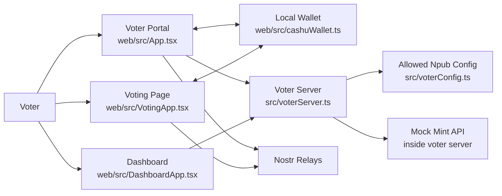
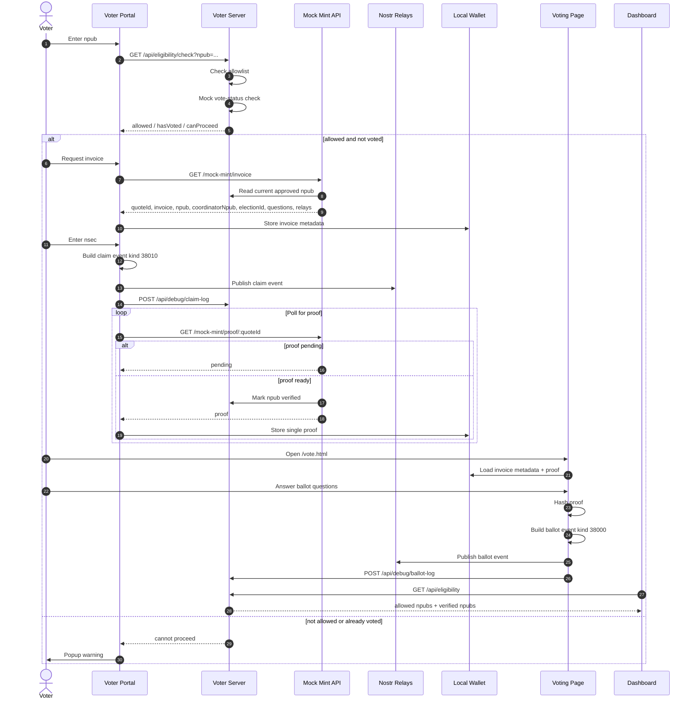
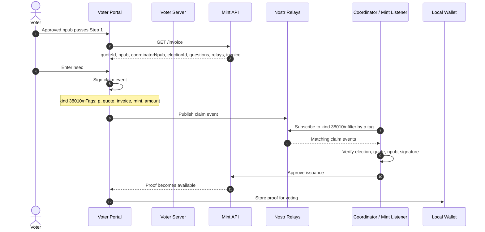

# Auditable Voting Demo

Local demo of a Nostr + Cashu-style voting flow.

The current project covers:

- local allowlist-based voter eligibility
- mock not-voted checks
- mock mint invoice -> proof issuance
- Nostr claim publishing for proof issuance
- ballot publishing with a proof hash
- operator dashboard for allowed and verified voters

## Overview

The system separates a few concerns:

- voter eligibility is based on an allowed list of `npubs`
- proof issuance is coordinated through a Mint API flow
- claim and ballot events are published through Nostr relays
- the final ballot carries a hash of the voter proof instead of the raw proof

Right now everything is simplified for local development:

- the allowed voter list is hardcoded in `src/voterConfig.ts`
- the already-voted check is mocked and always returns `false`
- the mint is mocked inside the same local server
- proof issuance is time-based, not real blinded ecash yet

## Component Architecture

[Open in Mermaid Live](https://mermaid.live/edit#pako:eJxlksFugzAQRH_F8rlp7lFVCbWXSkmEUqk9QA7GXsCqsZFtklZR_r0YGwyBA9p9OwN4lhumigHe4VKoK62Jtmh_yiXqry9lQWfD_exJqrQlwqPQ5PIKxdZouk3a9tma33M0p6QCJ-ayQq6OWg-Xjndi6kIRzbKpioYJLT3fRAiw2V5RIkITPbT3dB72luD4BH0ZTxWaXDr1xREPovpNyZJXWSL6cIChY9sVgc1MHkTTgUubHRT9GSqUpB-55NJwBmjQIzO8JahPIMifyY7KWB2afjLbANpsXqewl3QM-ZHPAoxrQy9uNIY039F6EhwOjxktVrSa-HrAYz4P2GWxerg_78PXxAF-wg3ohnCGdzdsa2jcn8qgJJ2w-H7_B_1T7NI=)



## Sequence Diagram

[Open in Mermaid Live](https://mermaid.live/edit#pako:eJyNVstu2zAQ_BVC19qWi14KAU2RNkEbIA8jKdJLLitqbROmSIWkHARB_r1LUi9bSlIfDC85s9xZDhd-SbguMMkSi481Ko5nAjYGygfF6AO106ouczRNzJ027F67dqEC4wQXFSjHVto4kAxsBDTxGHeHZk_bHS7GY9yVoC9CXWm-i8Hp6mIMu0UJzx53ra0zMbRj2F-QEkO-S82pzBiPcb6mFWywqU-oDfPhGHgGdptrMIVHdsGDisggbX5yEpuQsXPlpaqqzuN-XCdAVJ-xX-d_WAqVSFGKjciFFO455Vvku--e9W2xWERmJAyYPz2IkRz9JIV1b6BCF_dU1dw6cLVlIfcBeFBuyIYFS9kWrNfif3JQK6M5YqcSpOugoAqmtAtnFHF7qhG33mfWMaH2WnDsgV1H_FU3_Sip6HlJcTqCe9RA3i1CwXhtDHrTVJXRe6qp73dHGZTyWFNtF8WsrWUW8DPGtTaFUEBevw4LKJE7oZXHhurpt50xM7DagYLorYzdUQZss7MSHRTgoG3eOzaxyCfStqAftZAkVoIoGe694J2g5n_5uvy8nKCFF5GxVZ2TPbZD3gS47efq5q7xY4F5vUkDay71Zli91LoiqpRsTWOBeq7X_ebHdxoIadZcwyHTOyvsswoVXcbmcHvqOieBKC02iQxZ5PmNNIN3AmYXfMAoFGuBxX-cPFb-jh8sFSlxikQC-oUQjJ3SzqeM3ZBglvrntti6Uh5CPWRw8qWm53FsRPbpuIjxIafKPpEjc__KXW_-ycN61m8ah1O5R8Bo5Sb7oZeXy0nukZuH1En8W4aOxGNHd3P8g8ncM_rZ2XH78el9ZKnNrZXiQiQHZ_qB2YLpCYEMJj2eoeP5TKPYU6t2HI8sF26SVOuqrtgTGNW9DPJVMktKNCWIIsleErfF0v8DKHANtXTJ6-s_swabWQ==)



## Mint API Integration Diagram

[Open in Mermaid Live](https://mermaid.live/edit#pako:eJx1k01v2zAMhv8K4bOLtthl8KFAsRVDgTYIlqK75ELLtENMFl19GAiK_vdJVuI6TZaDE8oPX74klfdCSUNFVTh6C2QU_WTsLPZbA_GDwYsJfU32ECsvFl7FHw8GtJ4VD2g8rMV61IAuA4f4nNuQHePrmcvxOffM8RGp6ft-_XhO_CaN-4SsxHmbQ3eO_RCxDRtM3iO8DK-z-hM7T-aSiT-oNU02nkTF7nK8NZmcGri6u8utVnA_DFZGasAMoY46zpGDjacBbnNCBmNGKlvBr4cXuGYzCivKQDq_Wii-hVjisSknxRLUp_fVdECalGcxCYkLdOm3K8FOoyhh1r7s98GkBRhH6ou9I7DhzoDSyD3QSMZnbBVlQMZ5xxX8ZdPAt-83tzdb84Kdq2Aos_fZQwl97K0E7CUcheZ60-oqWIdas9udVszoYmuf_CbUTlmuCbyceGhZp87qPQzgscsSU1Ia7kKrgmf0asemWxZ1l2qeZL2S5XY_j39uNq_JxbGhD5Yu6eTVH64KsHMBzf_Wv7YiLdSkpI83CUdkjbWmL9PLlzKOIxYgGKacNt7uUXxsrCiLnmyP3BTVe-F31Kf_e0MtBu2Lj49_j5ZioA==)



## What Is Implemented

- A Node/TypeScript voter server in `src/voterServer.ts`
- Local allowed voter config in `src/voterConfig.ts`
- A voter portal in `web/src/App.tsx` for:
  - entering or generating an `npub`/`nsec`
  - checking whether the `npub` is on the allowlist
  - checking whether the voter has already voted via a mock API
  - requesting a mint invoice
  - signing and publishing an invoice claim to Nostr relays
  - polling for a proof
- A local single-proof wallet in `web/src/cashuWallet.ts`
- A voting page in `web/src/VotingApp.tsx` for:
  - loading election metadata from the stored invoice
  - answering 2 single-choice ballot questions
  - publishing a ballot event with a proof hash
- A dashboard in `web/src/DashboardApp.tsx` showing allowed and verified voters
- Server-side debug logs for:
  - invoice details
  - claim event details
  - publish results
  - proof details

## Current Flow

1. Start the local server
2. Open the voter portal
3. Enter an `npub` from the allowlist in `src/voterConfig.ts`
4. The server checks:
   - the `npub` is allowed
   - the `npub` has not voted yet (mocked to `false`)
5. If the check passes, request an invoice from the mock Mint API
6. The invoice response provides:
   - voter `npub`
   - coordinator `npub`
   - election ID
   - ballot questions
   - relay list
7. Sign the invoice claim locally with `nsec`
8. Publish that claim to Nostr relays
9. Poll until the proof is ready
10. Open the voting page and publish a ballot event with the proof hash

## Project Structure

```text
docs/                       design docs and planning notes
src/                        server and CLI TypeScript code
src/voterServer.ts          local voter server and mock mint
src/voterConfig.ts          hardcoded allowed npubs
web/                        React + Vite frontend
web/src/App.tsx             voter portal
web/src/VotingApp.tsx       voting page
web/src/DashboardApp.tsx    operator dashboard
web/src/cashuMintApi.ts     mock mint API client
web/src/cashuWallet.ts      single-proof local wallet storage
web/src/ballot.ts           ballot event publishing and proof hashing
web/src/nostrIdentity.ts    Nostr key and claim helpers
web/src/voterManagementApi.ts allowlist and vote-status API client
```

## Local Development

Install dependencies:

```bash
npm install
npm --prefix web install
```

Build:

```bash
npm run build
npm --prefix web run build
```

Start the local server:

```bash
npm run server
```

Start the frontend dev server:

```bash
npm --prefix web run dev
```

## Pages

- Voter portal: `http://localhost:5173/`
- Dashboard: `http://localhost:5173/dashboard.html`
- Voting page: `http://localhost:5173/vote.html`

## Current API Endpoints

- `GET /api/eligibility`
  - returns the local allowlist plus verified voters
- `GET /api/eligibility/check?npub=...`
  - checks whether the `npub` is in the allowlist and can proceed
- `GET /api/vote-status?npub=...`
  - mock vote-status API, currently always returns `hasVoted: false`
- `POST /api/debug/claim-log`
  - internal debug endpoint used by the frontend to mirror claim details into the server console
- `GET /mock-mint/invoice`
  - returns a mock invoice plus voter `npub`, coordinator `npub`, election ID, and ballot questions
- `GET /mock-mint/proof/:quoteId`
  - returns `pending` until proof issuance is ready, then returns the proof and marks the voter as verified

## Allowed Npubs

The current local allowlist lives in `src/voterConfig.ts`:

- `npub1ukdwfffcayn5pyt8duv5fyfkwyjrykgr2efql5vmj5y9df4c82lsgkypvg`
- `npub1kl7g5wf90gezwukh44jqtgh7dmdkv6nd20s7u88djqvv433x7ufsjrq6th`
- `npub1et7edyz9vcpdzljns4da5t7l7qgspe3dr6flx09x6jsy2sut5xfqyfnd3u`

## Notes

- State is in-memory only
- The mock already-voted API always returns `false`
- The local wallet stores one proof per voter session
- `nsec` stays in the browser and is never sent to the server or mint API
- The mock mint is not real blinded Cashu issuance yet

## Roadmap

- replace mock invoice/proof endpoints with the real teammate mint API
- replace the mock already-voted API with a real spent-proof / participation check
- move election config and ballot questions fully behind the mint/coordinator service
- implement real Cashu blind issuance
- submit proofs privately for vote counting
- build Merkle commitments and public verification tools

## Related Docs

- `docs/demo-development-plan.md`
- `docs/reference-architecture.md`
- `docs/cashu-nostr-voting-design.md`
- `docs/self-service-issuance-3-mint-model.md`
