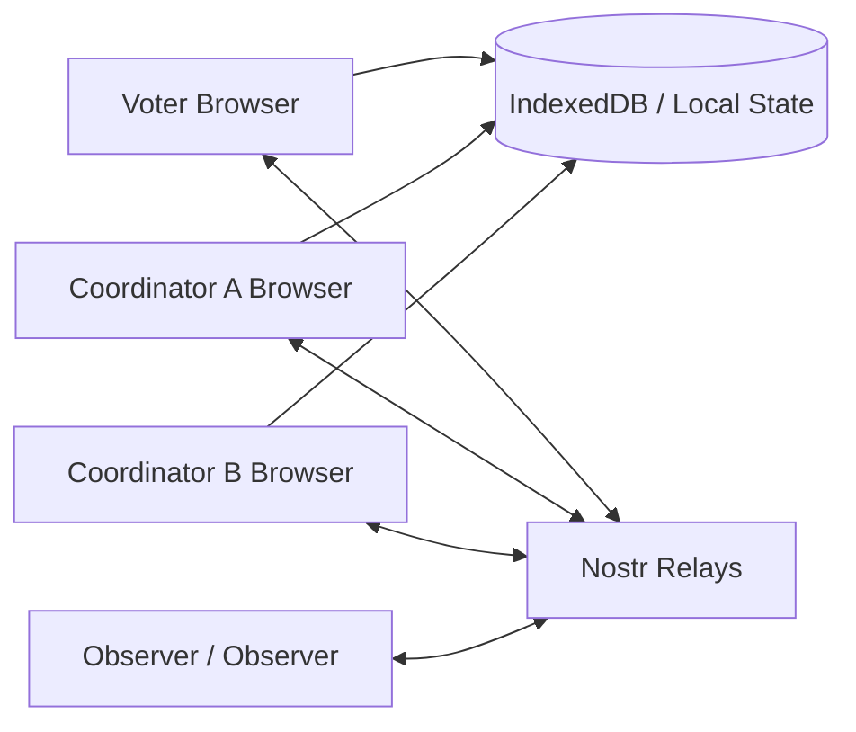
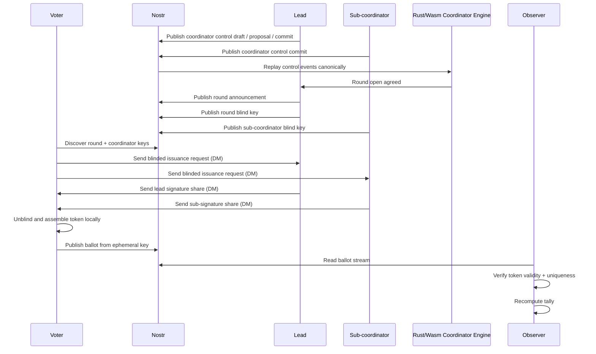
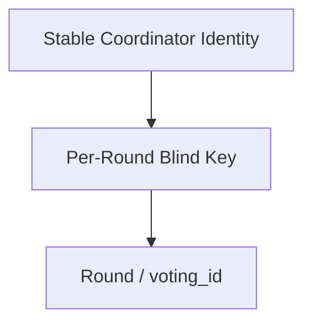
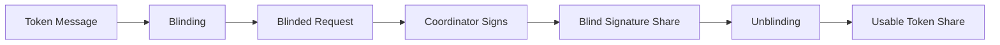
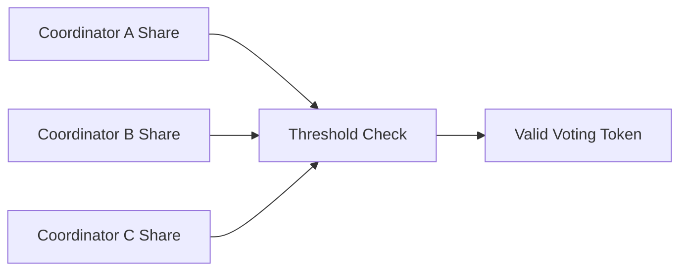
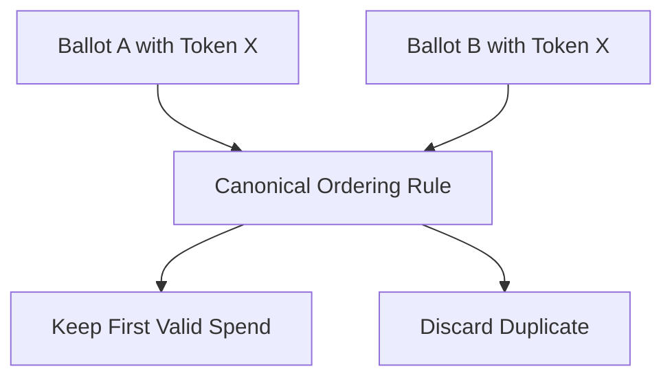
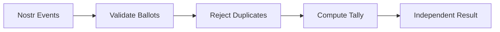
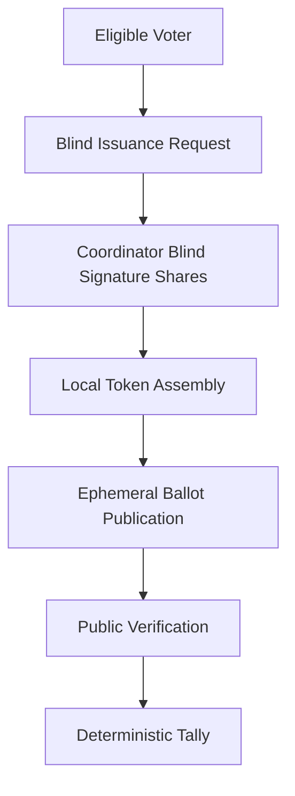

# Auditable Voting Explainer

This document is written as a technical explainer for readers who want to understand:

- what the system is trying to achieve
- why it uses public relay infrastructure and blind signatures
- how voters, coordinators, and observers interact
- what is public, what is private, and what can be verified

It is intended to read more like a protocol note than a product brochure: it describes the design goals, the concrete technologies used in the current implementation, the trust boundaries, and the places where the live system is still operationally weak.

For the questionnaire-first flow specifically, see the formal protocol reference at [`docs/questionnaire-blind-token-protocol.md`](./questionnaire-blind-token-protocol.md).

---

## 1. The Short Version

This project is an **anonymous, publicly auditable voting system**.

The intended model is:

1. A voter is confirmed as eligible by one or more coordinators.
2. The voter asks those coordinators to blindly sign a round-bound voting token.
3. The coordinators return blind signature shares without learning the final token.
4. The voter assembles a usable token locally.
5. The voter publishes a ballot to Nostr using an **ephemeral** key.
6. Anyone can verify:
   - the ballot belongs to a real issued token
   - the token was not spent twice
   - the tally is computed correctly from public data

The main goals are:

- **privacy**: coordinators should not be able to deanonymise ballots
- **auditability**: observers should be able to recompute the tally
- **portability**: the client can run as a static web app
- **resilience**: public relays act as the shared event layer (Nostr-compatible in the current implementation)

---

## Quick Start: Run an Auditable Vote in the Browser

This is the practical browser-based flow. Start as the coordinator, then use a separate browser profile, private window, or second device for the voter so each role has its own local identity.

### 1. Coordinator builds the questionnaire

1. Open the app as **Coordinator**.
2. Create or load a coordinator identity.
3. In **Build**, enter the questionnaire name, description, and questions. The Build heading shows the current name, for example `Build questionnaire: How did we do`.
4. Use **Generate ID** only when you want a fresh questionnaire ID. Use **Copy ID** beside the Questionnaire ID when sharing the public identifier with observers.
5. Use **Show questionnaire link** if you want a QR/link for the questionnaire.
6. Add or import voter `npub`s in **Invite**.
7. Send invites with **Invite** or **Invite all whitelisted**.
8. Click **Publish questionnaire** when the draft is ready. This publishes the questionnaire definition and opens the round.

### 2. Optional: coordinator enables an audit proxy

1. After publishing, click **Set up audit proxy** if this questionnaire should keep processing while the coordinator browser is offline.
2. The audit proxy section opens and generates a proxy account.
3. Copy the **Quick start command** and run it on the machine that should host the proxy.
4. Use **Audit proxy details** or **Helper download and launch command** if you need the helper download, checksum, or a direct launch command.
5. Wait for a heartbeat in **Audit proxy status** before relying on the proxy for issuance or verification.

### 3. Voter requests and submits

1. Open the invite link as the invited voter, or open the app as **Voter** and click **Check invites**.
2. Open the pending questionnaire.
3. Click **Request ballot** if the blind credential request does not start automatically.
4. Wait for `Credential ready: Yes`.
5. Complete the questionnaire and click **Submit response**.
6. If no proxy is selected, the coordinator browser must stay online long enough to process requests and responses. If a proxy is selected and active, the voter can wait for the proxy instead.

### 4. Coordinator or proxy processes responses

1. In the coordinator tab, use **Process requests** / **Check responses** while running browser-only.
2. If delegated, leave the helper running and check its heartbeat/reporting in **Audit proxy status**.
3. Close the questionnaire and publish final results when collection is complete, if you want a fixed final summary.

### 5. Observer verifies

1. Open the app as **Observer**.
2. Search by coordinator `npub` or questionnaire ID.
3. Confirm submitted votes, accepted responses, expected participant count, and result percentages from the public events.
4. The observer can show current accepted responses before closure when public response and decision events are available.

### Operational notes

- If a voter sees no invite, confirm they are using the same voter identity that was invited.
- Signed-in voters with no active invite now do a low-rate automatic invite refresh, so new invites should appear without manually pressing `Check invites`.
- A voter should not see unrelated questionnaires unless they have invite/state context for that identity.
- Relay connection failures for one endpoint are common on public infrastructure; retries and other relays should still allow progress.
- Private questionnaire recovery now uses shared websocket inbox subscriptions, duplicate-event suppression before signer decrypt, sticky successful relay subsets, and bounded refreshes on focus/visibility/online instead of relying only on repeated timer-driven resend loops.
- While waiting for a ballot on signer-backed mobile browsers, the client now mostly re-arms DM subscriptions and only falls back to low-rate mailbox refresh reads, reducing Amber bunker/rate-limit churn while still recovering when push delivery is missed. Successful signer DM decrypts are cached per event so repeated recovery scans do not keep re-asking Amber to unwrap the same gift-wrapped message.
- Blind issuance discovery now also performs one broader relay fallback scan when the narrow recipient relay subset is empty, reducing cases where a ballot is visible in another Nostr client before the vote UI notices it.
- In coordinator results, free-text values stored as `enc:nip44v2:` can now be decrypted locally when the coordinator key is available.
- Coordinator `Closing / Closed` metadata now reflects actual close-state timing and marks overdue open rounds as `Past due` to avoid misleading historical timestamps.
- Observer coordinator filters are now retained across refresh/fetch churn, and selected-round refreshes use lighter kind-only relay reads to reduce relay notice spam.

---

## 2. What Problem It Solves

Traditional online voting systems often force a tradeoff:

- either the operator knows who voted for what
- or the public cannot independently verify the result

This project tries to avoid both failures.

It separates the process into two parts:

- **issuance**: proving a voter is allowed to vote and giving them a private credential
- **voting**: spending that credential anonymously in public

That split is the reason blind signatures matter.

---

## 3. Core Idea

The key trick is:

- a coordinator signs a **blinded** message
- the voter later **unblinds** it
- the final token is valid
- but the coordinator should not be able to link the final token back to the specific issuance request

That gives the voter a token which is:

- valid
- anonymous
- publicly spendable once

---

## 4. Main Actors

### Voter

The voter:

- has a real long-term Nostr identity
- proves eligibility out of band
- requests blind signatures
- combines enough shares
- votes using an **ephemeral** ballot key

### Coordinator

A coordinator:

- verifies voter eligibility
- publishes voting rounds
- exchanges round-control messages with other coordinators
- issues blind signature shares
- validates ballots
- tallies votes

### Observer / Validator

An observer:

- watches public Nostr events
- verifies ballot validity rules
- rejects duplicates
- recomputes the tally independently

### Nostr Relays

Relays are the shared event layer:

- coordinator control carrier events
- public rounds
- public ballots
- public results
- private encrypted mailbox objects for issuance-related traffic

---

## 5. High-Level Architecture

### Storage model

The migration direction is:

- **Nostr**: canonical shared state
- **IndexedDB**: local active state and secrets
- **Blossom**: planned encrypted backup bundles

This matters because the system is trying to move toward a client-side model, not a traditional central server.

### Technologies used in the current implementation

The present web client is built with:

- **React 18** for the voter, coordinator, and observer interfaces
- **TypeScript 5** for the browser application logic
- **Vite 5** for local development and static-site bundling
- **`nostr-tools` 2.x** for Nostr keys, event signing, subscriptions, and relay publishing
- **a dedicated coordinator-control carrier over Nostr** for round proposals, commits, tally coordination, and recovery checkpoints
- **regular custom Nostr event kinds** for coordinator control, live rounds, and ballots, so relays preserve the full transcript instead of replacing events in the `30000`-range
- **NIP-17 gift-wrapped DMs** for follow, roster, MLS welcome, and share-assignment traffic
- **NIP-17 gift-wrapped DMs** for blind ballot requests, blind issuance delivery, ballot submissions, and acceptance results (with local mailbox fallback for same-browser recovery), plus encrypted mailbox objects for legacy ticket delivery, acknowledgement traffic, and history-based recovery, with stable `request_id`, `ticket_id`, and `ack_id` lineages
- **optional NIP-65 relay hints**, disabled by default, for relay discovery experiments
- **`@cloudflare/blindrsa-ts`** for the RSABSSA blind-signature primitive used in the current issuance path
- **Rust compiled to WebAssembly** for deterministic protocol logic, including validation helpers and the new coordinator control engine
- **an optional Rust audit proxy runtime** (`worker/`) for election-scoped delegated issuance/verification operations over outbound-only relay connections, with coordinator-signed delegation and revocation control
- **seven-day fixed-lookback audit proxy DM polling with event-id dedupe**, so relay-randomised gift-wrap timestamps do not cause missed delegated blind requests; the helper publishes status heartbeats back to the coordinator, uses active delegation control relays in addition to startup relays, and defaults to control relays that accept `#p` gift-wrap reads
- **a real OpenMLS-backed coordinator engine inside the Rust core**, hidden behind a stable Rust abstraction so the browser code does not depend on MLS types directly; the browser coordinator path now bootstraps and joins the supervisory MLS group through Nostr carrier events, and the lead waits for sub-coordinator welcome acknowledgement only after the non-lead has completed an initial coordinator-control backfill pass before opening the first public round in the repaired small live cases
- **a Rust mixed-replay engine for public rounds and ballots**, now used by the voter, coordinator, and observer public-state views to derive round state, accepted ballots, and rejection reasons
- **versioned Rust snapshots and replay diagnostics** for the shared protocol engine, so the browser can restore state, validate snapshot compatibility, and surface replay issues without re-implementing protocol rules in TypeScript
- **coordinator runtime readiness diagnostics** surfaced in the browser for MLS join, welcome acknowledgement, initial control backfill, auto-approval, round-open safety, blind-key safety, and ticket-plane safety
- **startup control-carrier diagnostics** for exact publish payloads, live/backfill filter shapes, relay write/read overlap, and `kind_only` versus filtered startup probes
- **single-coordinator deterministic startup bypass** so `1 coordinator` runs do not block on MLS join/group observation paths
- **blind-key publication diagnostics** that classify not-attempted vs publish/observe/apply stalls and expose event/relay evidence
- **private-first questionnaire flow** with coordinator/voter UI panels, RSABSSA blind-token issuance, ephemeral response npubs, transport helpers, and relay-harness metrics
- **staged questionnaire coordinator builder** (`Build` -> `Audience` -> `Publish` -> `Responses` -> `Results`) with zero default questions and explicit publish readiness checks
- **voter questionnaire vote gating** that only enables Vote after announced questionnaire ids are verified as publicly readable (`definition` present + state `open`/`published`)
- **questionnaire discovery over direct live subscriptions** with one startup backfill plus one bounded retry, and explicit per-voter discovery timing diagnostics for startup visibility failures
- **voter draft preservation** so response fields are not cleared when a blind ballot credential or refreshed definition arrives for the same questionnaire
- **linked invite login** that opens the public questionnaire without scanning old encrypted invite DMs, with recent bounded signer DM reads for manual invite checks and credential-result polling
- **Android signer routing** that prefers Amber through NIP-46 when available, keeping signer-backed questionnaire DM operations on one signer identity
- **gateway Nostr Connect helpers** that present login controls in order (`Signer`/`nsec`, then `NOS2X-FOX`/`Amber`, then a single login action), can generate/copy a `nostrconnect://` URL, show it as a QR code, and expose an Amber-compatible `bunker://` (`nsecbunker`) copy path
- **blind DM relay targeting** so blind request/issuance/submission/acceptance DMs resolve recipient `kind:10050` relay-list hints before static fallbacks
- **strict DM delivery confirmation** so blind-request and ballot-submission flows only mark "sent" after at least one relay confirms acceptance, avoiding silent transport failure states
- **clearer voter ballot progress** that labels the per-questionnaire voting identity separately from the signer account and shows request, credential, and response state
- **safer voter tab switching** so `Vote` remains available for browsing current and older invited questionnaires and background invite refresh does not force the UI away from Configure/Settings
- **self-copy submission recovery** that sends a best-effort encrypted copy of each ephemeral-key submission to the voter's login identity, so returning voters can recover submitted response markers and answers from their own NIP-17 mailbox
- **coordinator self-copy state recovery** that sends coordinator questionnaire state snapshots (excluding private blind-signing key material) to the coordinator's own NIP-17 mailbox so signed-in coordinators can recover state after reload/login
- **relay-copy quorum checks for state backups** so voter/coordinator self-state DM snapshots are only marked successful after read-after-write confirmation on at least two relays
- **single-flight coordinator queue processing** so automatic request/submission checks do not overlap relay work
- **idempotent ballot resend** so a voter can resend the same blind request, the coordinator republishes the existing credential DM, and background loops avoid rebroadcasting already delivered credentials
- **more redundant DM delivery** that mixes recipient NIP-17 relay hints with fallback relays, widens credential publish fanout, and retries issued credentials until submission proves receipt
- **wider bounded signer DM scans** for invite/issuance/acceptance recovery so Amber/signer users are less likely to miss valid envelopes in busy relay histories
- **explicit questionnaire phase acknowledgements** for blind request receipt, credential receipt, and submission receipt, so resend logic can stop once delivery is confirmed instead of inferring success only from later state
- **shared recipient inbox subscriptions + sticky relay preferences** so private questionnaire reads reuse one websocket inbox per recipient, remember recently successful relays per questionnaire, and trigger bounded lifecycle recovery on foreground/network return
- **course-feedback coordinator bypass** so legacy live-round / blind-key / ticket queue gating is disabled for questionnaire acceptance paths, with explicit debug assertions for bypass state
- **course-feedback batch orchestration** in the live harness (`LIVE_BATCH_SIZE`, default `5`) so enrolment and submission advance in checkpointed waves instead of all-voter cold-start concurrency
- **questionnaire response observation fallback** that prefers bounded kind-only reads plus local questionnaire-id filtering (and relay probes) when custom tag-indexed reads are unreliable on public relays
- **observer coordinator filtering + search** so public round review can be scoped by lead coordinator, coordinator npub, and free-text query (npub/round ID/prompt), with non-overlapping refreshes to reduce relay REQ bursts
- **observer historic search** so the normal view stays bounded to recent questionnaire data, but observers can explicitly scan a wider historical window when an older published questionnaire or public result payload is missing
- **observer questionnaire discovery** so recent public questionnaire definitions are read by kind-only backfill when no questionnaire ID is selected, with state, replaceable expected-participant count events, live verified response totals, and published response totals shown when available
- **ticket scheduler diagnostics and tunable transport knobs** for first-send prioritisation, resend eligibility reasons, bounded concurrency, and retry-age experimentation during live relay reliability testing
- **observation-plane recovery diagnostics** that separate live vs backfill visibility and classify resend recoveries for published-but-unobserved tickets
- **request-id keyed mailbox reader bindings** with immutable per-request mailbox ids for live/backfill ticket observation, plus explicit read/backfill mailbox-consistency diagnostics
- **IndexedDB** for browser-local active state
- **WebCrypto** for local encryption and passphrase-protected state

That mix matters scientifically because the system is not just a protocol sketch. It is a concrete static web application built from standard browser primitives, a public event network, and a conservative blind-signature library.

---

## 6. What Is Public vs Private

### Public on Nostr

- coordinator-control carrier events
- round announcements
- coordinator identities
- blind key announcements
- ballots
- tally / result events

### Private or local

- coordinator private signing keys
- voter private keys
- blind request secrets
- unspent credential material
- coordinator control snapshots and replay checkpoints
- local cache / restore bundles

### Private mailbox traffic

- follow / join coordination
- blind issuance requests
- blind issuance responses sent directly from each coordinator to the voter
- ticket acknowledgements
- for initial course-feedback mode (`1 coordinator / 25 voters / 1 round`), acknowledgement visibility is best-effort and valid ballot acceptance is treated as delivery confirmation
- automatic retry of unacknowledged ticket delivery with stable logical ids
- periodic history backfill for missed live rounds and mailbox objects

### Coordinator control path

The coordinator-to-coordinator control path is now separate from the voter issuance path.

In the current migration phase:

- coordinators publish typed control envelopes to a dedicated Nostr carrier stream
- the browser feeds those events into a Rust/Wasm engine
- the Rust engine applies canonical ordering, replay, and state transitions
- the lead only publishes the public live round after that control state reaches round-open agreement and the supervisory MLS path has confirmed first-round welcome application plus initial non-lead control-plane sync

That means coordinator round agreement is no longer inferred ad hoc from UI state or DM arrival order.

### Public replay path

The public round and ballot plane is also moving under Rust protocol control.

In the current migration slice:

- public round-open events and public ballot events are normalised by the browser bridge
- the Rust/Wasm core replays those events under one canonical ordering rule
- ballot acceptance uses one fixed rule, documented in code: **first valid ballot wins**
- accepted ballots now carry stable `request_id` / `ticket_id` lineage through Rust replay for coordinator row mapping and harness truth
- the voter, coordinator, and observer public-state views now consume that Rust-derived state instead of separate TypeScript reducers

---

## 7. The End-to-End Flow

---

## 8. Round Announcement

A coordinator publishes a live round. In the simple flow this includes:

- `voting_id`
- prompt / question
- threshold information
- authorised coordinator roster

This tells voters:

- which round is active
- which coordinators are valid for the round
- how many shares are needed

### Why round-bound matters

Tickets or tokens are tied to a specific `voting_id`.

That prevents a credential issued for round A from being replayed in round B.

---

## 9. Blind Key Announcement

Each coordinator publishes a **per-round blind-signing key announcement**.

That key is:

- specific to the round
- signed by the coordinator’s stable identity
- used for validating that round’s blind shares

This is important because it avoids using one long-lived blind-signing key for every election forever.

---

## 10. Blind Issuance

The voter never asks the coordinator to sign the final token directly.

Instead:

1. The voter creates a token message locally.
2. The voter blinds it.
3. The blinded request is sent to the coordinator.
4. The coordinator signs the blinded request.
5. The voter unblinds the result locally.

If done correctly, the coordinator signs *something valid* without learning the final token that will later appear in public voting.

---

## 11. Threshold Model

The target direction is a threshold model:

- multiple coordinators may issue shares
- the voter needs enough valid shares to vote

Example:

- 3 coordinators exist
- threshold is 2-of-3
- any 2 valid shares are enough

### Important validation rule

Shares must be checked against:

- the round’s authorised coordinator roster
- the round’s blind key announcements
- the threshold rule for that round

---

## 12. Ballot Publication

Once the voter has enough valid share material:

- the voter creates an **ephemeral** ballot keypair
- the voter publishes a public ballot to Nostr

The public ballot should expose only what is needed to verify the vote, not what would link it back to issuance. That is where the privacy property from blind issuance either survives or gets lost.

### Public ballot goals

- contains the vote choice
- contains anonymous proof material
- can be validated publicly
- omits issuance-linking fields, so the coordinator cannot tie the final ballot back to the original blind request

---

## 13. Duplicate Spend Prevention

A valid anonymous vote is still only supposed to count **once**.

That means the system needs deterministic duplicate handling:

- if the same token is spent twice
- everyone must agree which spend counts
- later spends must be rejected

The current direction is:

- first valid spend wins
- ordering must be **canonical**, based on signed Nostr event metadata
- all observers should converge on the same result

This is a correctness problem, not just a UI problem.

---

## 14. Auditability

An outsider should be able to reconstruct the tally from public events.

That means:

- ballots are public
- duplicate rejection is deterministic
- tallying rules are deterministic
- results are reproducible from relay history
- coordinators publish a separate parameterised replaceable expected-participant count event, so observers can compare accepted responses with expected turnout without seeing the private invite list

Before a final result summary exists, the Observer view derives a live provisional summary from verified public submissions and labels it as live relay-derived data. This is the “auditable” part of auditable voting.

---

## 15. Why Nostr

Nostr gives the project a shared, replayable event layer without requiring one central database.

Benefits:

- multi-relay distribution
- public reproducibility
- portable client architecture
- no single relay is supposed to be the whole truth

In this repo, relay selection can optionally use **NIP-65 inbox/outbox hints** so senders and receivers can better choose where to publish and subscribe.

That path is currently **disabled by default** in the UI, because a tighter curated relay set has been more reliable in practice than always expanding through public relay hints.

The current client also distinguishes between:

- **publish fanout**, which can still send to several relays
- **read/subscription fanout**, which is intentionally kept to a smaller primary subset

That split reduces relay-side `too many concurrent REQs` failures while keeping the write path reasonably redundant.
Automatic voter and coordinator actions are also paced with a random `0-30s` delay, slower retry windows, and a sender-scoped ticket publish queue so many browser actors do not all publish into the same public relays at once. The audit proxy defaults and generated helper commands now use `relay.nostr.net` and `nos.lol` only, and persisted legacy delegated relay lists are sanitised back to that pair before polling; browser-side NIP-17 reads still prefer relays that accept `#p` gift-wrap filters before falling back to endpoints known to reject those filters as unindexed. Mailbox publishes keep one deterministic anchor relay, rotate secondary relays by recipient, and apply temporary cooldowns when relays return rate-limit/pow/spam/policy failures.

---

## 16. Why Local State Still Exists

Even in a client-side architecture, some things cannot live only on relays:

- private keys
- blind request secrets
- pending local voting state
- restore data

That is why IndexedDB matters.

The browser stores:

- local identities
- cached round state
- blind request state
- received shares
- coordinator private material

Planned backup direction:

- export encrypted bundles
- optional upload to Blossom
- restore on a new device

---

## 17. Security Goals

The intended security properties are:

### Ballot privacy

Coordinators should not be able to tell which final ballot belongs to which issuance request.

### One-person-one-vote

Only eligible voters should receive valid voting credentials.

### No double voting

A token should only count once.

### Public verifiability

Anyone should be able to recompute the tally.

### No single coordinator trust anchor

Threshold issuance means one coordinator alone should not define the whole system.

---

## 18. Current State of the Repo

The repository now focuses on the client-side web app only:

- `/` now opens a login + role gateway instead of forcing voter mode
- role selection is explicit (`voter`, `coordinator`, `observer`) and persisted into URL only after user selection
- signer login now tolerates delayed NIP-07 injection and `nostr:ready` signalling for Firefox/Android-style signer bridges
- `simple.html` is the main client-side shell
- voter and coordinator flows use `Configure`, `Vote`/`Voting`, and `Settings` tabs
- coordinator round-open agreement now goes through a Rust/Wasm coordinator-control service
- coordinator control messages are replayed deterministically from Nostr history instead of being inferred from relay arrival order
- the voter, coordinator, and observer public-state views now use shared Rust-derived replay state
- adding a coordinator in the voter flow immediately starts the follow/notify DM path
- the lead coordinator now auto-sends share indexes to sub-coordinators
- each coordinator sends its own ticket share directly to the voter
- non-lead ticket sends are slightly staggered by share index to reduce same-recipient relay bursts
- automatic follow, blind-request, ticket, and acknowledgement sends are randomly delayed by up to `30s` to better match real participants and reduce relay rate limiting
- accepted followers now receive active questionnaire ids (`open`/`published`) in coordinator roster DMs, so voter questionnaire selection can auto-populate without manual restore
- voter questionnaire submissions now spend a blind-signed credential from a fresh ephemeral response npub, with one accepted spend per questionnaire credential
- coordinator follower rows expose per-ticket relay publish diagnostics
- Nostr is the shared state layer
- blind-share issuance is in the simple flow
- NIP-65 relay hints are optional and disabled by default
- live reads and subscriptions are capped to a small primary relay subset, while publishes can still fan out more broadly
- local browser state is used for active session data
- voter questionnaire participation history is kept in local browser state and carried inside voter backup/restore bundles

The older backend-oriented stack has been removed from this repository.
The client-only architecture is in place, but live relay reliability and recovery behaviour still need hardening.
Current live evidence is mixed: `1 coordinator / 2 voters / 2 rounds` has completed cleanly in recent local-preview tests, while larger public-relay runs can still expose rate limiting and delayed convergence in the private ticket/ack path. The live harness now waits for the lead coordinator to be visibly ready before firing round 1, coordinator pages expose explicit runtime-readiness phases, failed live harness runs carry protocol-layer classification plus coordinator/voter readiness snapshots, and automatic follow/request/ticket/ack sends are spread with random human-style delays plus longer retry windows. That improves diagnosis and reduces relay bursts, but repeated multi-coordinator reliability at larger scale is still not signed off.

### Migration seam status

The current coordinator-control seam is intentionally incremental:

- the voter issuance path still uses the existing blind-signature DM flow
- the public ballot and observer path still use public Nostr events, but the observer’s reducer logic is now Rust-owned
- the coordinator control path and the observer’s public replay path now run behind the Rust/Wasm replay engine

That keeps the user-facing flow largely intact while moving the most order-sensitive coordinator logic out of React components.

---

## 19. Current Risks and Hard Problems

The interesting parts of this project are also the risky parts.

### 1. Privacy can be broken by bad ballot design

If the public ballot includes issuance-linking fields, coordinator-to-ballot anonymity is lost.

### 2. Duplicate handling must be canonical

If different observers disagree about which spend was first, the tally is not stable.

### 3. Coordinator key custody matters

If coordinator signing keys are exposed in browser storage, an attacker can mint fake voting rights.

### 4. Relay delivery is messy in the real world

Live relay behavior is probabilistic, so follow requests, announcements, blind requests, and tickets all need recovery and reconciliation logic.
The current app now does better at small scale by limiting live read fanout, widening coordinator-control and ticket/ack traffic slightly beyond ordinary DM reads, backfilling both live rounds and ticket traffic from history, gating the first multi-coordinator round on MLS welcome acknowledgement after non-lead control-plane sync, waiting in the live harness until the lead is visibly ready before firing round 1, queueing DM publishes per sender-recipient conversation instead of per recipient only, serialising one coordinator's mailbox ticket publishes through a sender-scoped queue, keeping one deterministic mailbox anchor relay while rotating secondary relays by recipient, temporarily cooling down relays that return rate-limit/pow/spam/policy failures, adding random `0-30s` human-style delays before automatic follow/request/ticket/ack sends, increasing retry windows, preserving prior ticket attempt identifiers so later acknowledgements are not lost when a resend replaces the latest tracked response, and keeping shard-request ids stable end to end instead of letting the DM envelope and blind request disagree about the logical request id. That is enough to make the failure mode much clearer and to reduce relay-rate bursts, but it is still not enough to make large committee runs production-grade on public relays: the latest trustworthy `5 / 10 / 3` run before this request-id fix was getting materially through round 1, then timing out later under a mixed send/ack bottleneck, with acknowledgement visibility still worse than send-side delivery.

The live harness now also classifies failures at the protocol layer, not just the browser or harness layer. A failed run is labelled as `startup`, `dm_pipeline`, or `mixed`, and the timeout dump includes coordinator readiness summaries plus per-voter round-visibility snapshots so the failure can be analysed without relying only on screenshots.

### 5. Cryptography must be conservative

Blind-signature code is not a place for “close enough”.

---

## 20. Mental Model for Teaching

A useful way to explain the system is:

> “A voter gets a private stamp of eligibility without revealing the final ballot token, then spends that token publicly once, and everyone can verify the tally.”

Or even shorter:

> “Private issuance, public spending, public audit.”

---

## 21. Teaching Diagram: The Whole Story

---

## 22. Suggested Audience-Specific Summary

### For non-technical audiences

This project aims to let people vote anonymously online while still allowing everyone to verify the final count.

### For developers

This is a Nostr-based anonymous voting system using blind threshold issuance, ephemeral ballot identities, deterministic duplicate rejection, and replayable public tallying.

### For security-minded audiences

The project is attempting to separate voter eligibility from public ballot identity, so coordinators can help issue voting credentials without being able to deanonymise the final vote.

---

## 23. One-Sentence Summary

**Auditable Voting is an attempt to combine anonymous credential issuance, public Nostr ballot publication, and independent tally verification in a client-heavy architecture.**

---

## 24. Questionnaire Runtime (Current Tranche)

The voter questionnaire now uses a single entry path:

- the questionnaire runtime is the default voter questionnaire path
- no `qflow` / `questionnaire_flow` URL gate is required for normal use

The questionnaire runtime currently provides:

- signer-based login entry points in voter/coordinator questionnaire headers
- coordinator whitelist and invite actions
- invite delivery over NIP-17 gift-wrapped DMs (`kind 1059` with `kind 13` seal / `kind 14` rumor), with bounded recent relay-history invite discovery on manual voter checks
- published questionnaire definitions that include the blind-signing public key, plus caching and invite-attached definitions, so voters can render linked questionnaires and request ballots even when the signer cannot read historical invite DMs
- credential-attached definition refreshes that do not clear drafted response fields
- RSABSSA blind request creation from a voter-held token secret
- coordinator blind issuance processing over a blinded token message
- local unblinding and verification before ballot submission
- fresh ephemeral response npubs for ballot submission, instead of using the invited voter npub as the response identity
- single accepted submission accounting with duplicate protection
- local resume keyed by election id and signer `npub`
- invite-link signer login opens the voter Vote tab directly, completes the signer-backed voter login, and can auto-prepare/send the first blind request once login is verified
- Android Amber NIP-46 sessions now request `sign_event`, `nip04_encrypt/decrypt`, and `nip44_encrypt/decrypt` up front during connect so later flow steps do not trigger capability escalation prompts
- invite/login npubs and local voter/responder npubs may differ; the invite can be opened against the current local voter identity, then the coordinator either auto-issues for whitelisted voters or manually authorises unexpected requesters
- invites are durable and can remain idle indefinitely; ballot request retries preserve the same request id and re-queue until the coordinator issues a credential, and the credential issuance can also carry the questionnaire definition as a recovery path
- delegated blind-token routing is cached in the invite and election summary, and the voter still re-checks the public delegation before falling back to that cached audit proxy `npub`
- accepted DM submissions feed the same coordinator response summaries as public questionnaire response events
- after a response is submitted, the voter Vote page shows the responder marker with its coloured pattern and expandable QR
