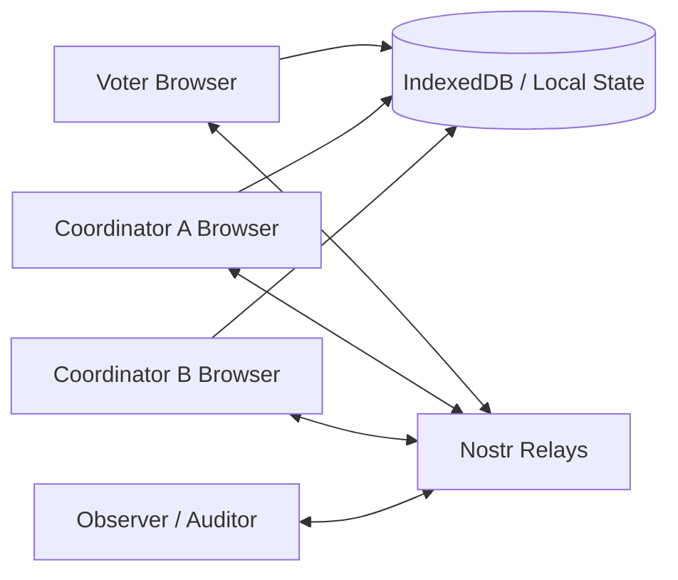
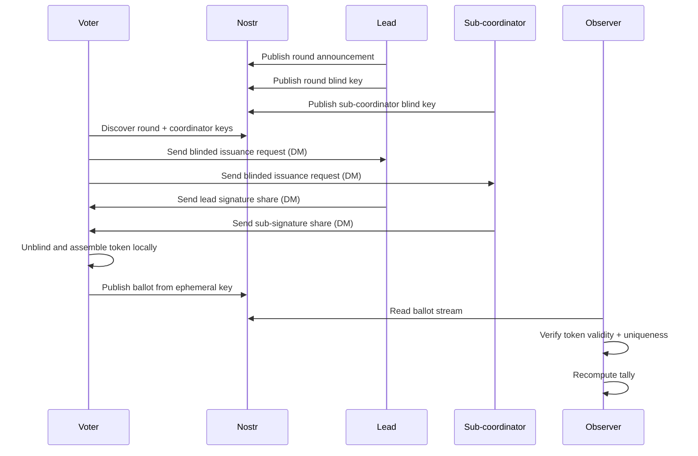
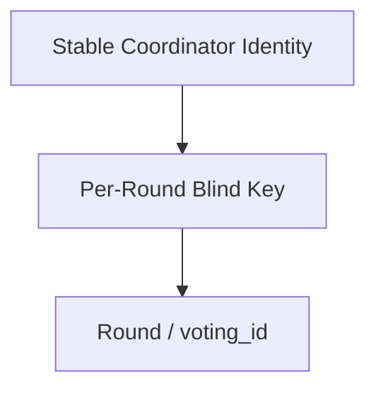
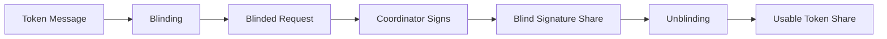
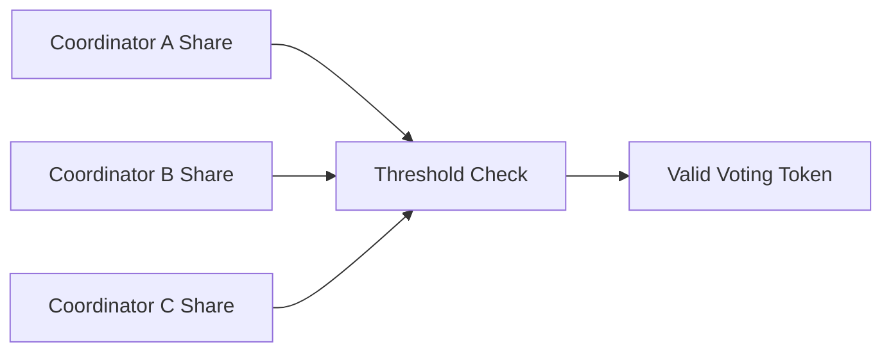
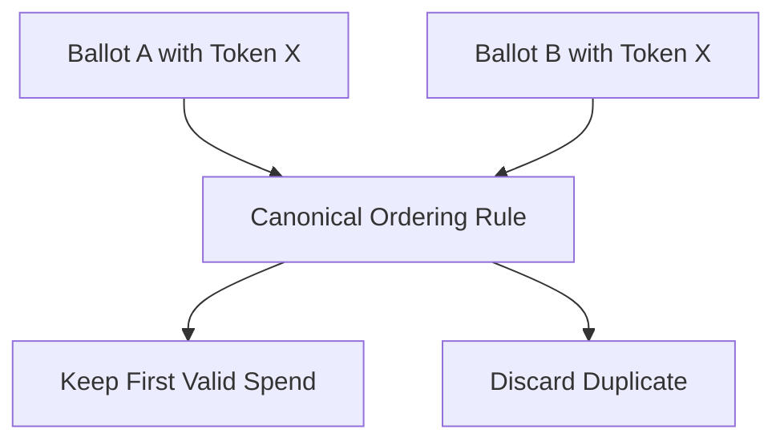
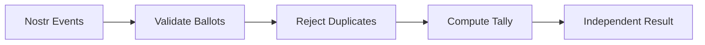
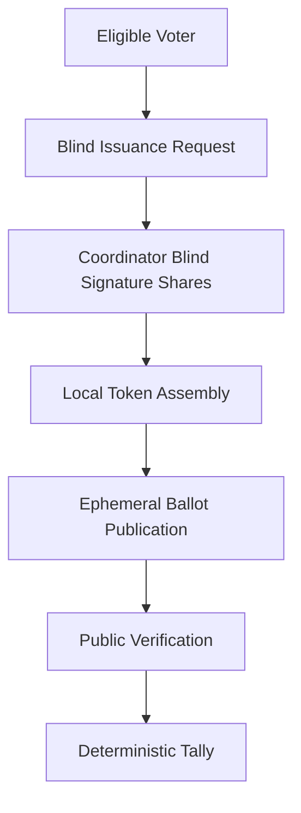

# Auditable Voting Explainer

This document is written as a technical explainer for readers who want to understand:

- what the system is trying to achieve
- why it uses Nostr and blind signatures
- how voters, coordinators, and observers interact
- what is public, what is private, and what can be verified

It is intended to read more like a protocol note than a product brochure: it describes the design goals, the concrete technologies used in the current implementation, the trust boundaries, and the places where the live system is still operationally weak.

---

## 1. The Short Version

This project is an **anonymous, publicly auditable voting system**.

The intended model is:

1. A voter is confirmed as eligible by one or more coordinators.
2. The voter asks those coordinators to blindly sign a round-bound voting token.
3. The coordinators return blind signature shares without learning the final token.
4. The voter assembles a usable token locally.
5. The voter publishes a ballot to Nostr using an **ephemeral** key.
6. Anyone can verify:
   - the ballot belongs to a real issued token
   - the token was not spent twice
   - the tally is computed correctly from public data

The main goals are:

- **privacy**: coordinators should not be able to deanonymise ballots
- **auditability**: observers should be able to recompute the tally
- **portability**: the client can run as a static web app
- **resilience**: Nostr relays act as the shared public event layer

---

## 2. What Problem It Solves

Traditional online voting systems often force a tradeoff:

- either the operator knows who voted for what
- or the public cannot independently verify the result

This project tries to avoid both failures.

It separates the process into two parts:

- **issuance**: proving a voter is allowed to vote and giving them a private credential
- **voting**: spending that credential anonymously in public

That split is the reason blind signatures matter.

---

## 3. Core Idea

The key trick is:

- a coordinator signs a **blinded** message
- the voter later **unblinds** it
- the final token is valid
- but the coordinator should not be able to link the final token back to the specific issuance request

That gives the voter a token which is:

- valid
- anonymous
- publicly spendable once

---

## 4. Main Actors

### Voter

The voter:

- has a real long-term Nostr identity
- proves eligibility out of band
- requests blind signatures
- combines enough shares
- votes using an **ephemeral** ballot key

### Coordinator

A coordinator:

- verifies voter eligibility
- publishes voting rounds
- issues blind signature shares
- validates ballots
- tallies votes

### Observer / Validator

An observer:

- watches public Nostr events
- verifies ballot validity rules
- rejects duplicates
- recomputes the tally independently

### Nostr Relays

Relays are the shared event layer:

- public rounds
- public ballots
- public results
- private DMs for issuance-related traffic

---

## 5. High-Level Architecture

### Storage model

The migration direction is:

- **Nostr**: canonical shared state
- **IndexedDB**: local active state and secrets
- **Blossom**: planned encrypted backup bundles

This matters because the system is trying to move toward a client-side model, not a traditional central server.

### Technologies used in the current implementation

The present web client is built with:

- **React 18** for the voter, coordinator, and auditor interfaces
- **TypeScript 5** for the browser application logic
- **Vite 5** for local development and static-site bundling
- **`nostr-tools` 2.x** for Nostr keys, event signing, subscriptions, and relay publishing
- **NIP-17 gift-wrapped DMs** for follow, issuance, direct ticket delivery, and acknowledgement traffic
- **optional NIP-65 relay hints**, disabled by default, for relay discovery experiments
- **`@cloudflare/blindrsa-ts`** for the RSABSSA blind-signature primitive used in the current issuance path
- **Rust compiled to WebAssembly** for deterministic protocol logic, including parts of validation and relay-set handling
- **IndexedDB** for browser-local active state
- **WebCrypto** for local encryption and passphrase-protected state

That mix matters scientifically because the system is not just a protocol sketch. It is a concrete static web application built from standard browser primitives, a public event network, and a conservative blind-signature library.

---

## 6. What Is Public vs Private

### Public on Nostr

- round announcements
- coordinator identities
- blind key announcements
- ballots
- tally / result events

### Private or local

- coordinator private signing keys
- voter private keys
- blind request secrets
- unspent credential material
- local cache / restore bundles

### Private DM traffic

- follow / join coordination
- blind issuance requests
- blind issuance responses sent directly from each coordinator to the voter
- acknowledgements
- automatic retry of unacknowledged ticket delivery
- periodic history backfill for missed ticket DMs

---

## 7. The End-to-End Flow

---

## 8. Round Announcement

A coordinator publishes a live round. In the simple flow this includes:

- `voting_id`
- prompt / question
- threshold information
- authorised coordinator roster

This tells voters:

- which round is active
- which coordinators are valid for the round
- how many shares are needed

### Why round-bound matters

Tickets or tokens are tied to a specific `voting_id`.

That prevents a credential issued for round A from being replayed in round B.

---

## 9. Blind Key Announcement

Each coordinator publishes a **per-round blind-signing key announcement**.

That key is:

- specific to the round
- signed by the coordinator’s stable identity
- used for validating that round’s blind shares

This is important because it avoids using one long-lived blind-signing key for every election forever.

---

## 10. Blind Issuance

The voter never asks the coordinator to sign the final token directly.

Instead:

1. The voter creates a token message locally.
2. The voter blinds it.
3. The blinded request is sent to the coordinator.
4. The coordinator signs the blinded request.
5. The voter unblinds the result locally.

If done correctly, the coordinator signs *something valid* without learning the final token that will later appear in public voting.

---

## 11. Threshold Model

The target direction is a threshold model:

- multiple coordinators may issue shares
- the voter needs enough valid shares to vote

Example:

- 3 coordinators exist
- threshold is 2-of-3
- any 2 valid shares are enough

### Important validation rule

Shares must be checked against:

- the round’s authorised coordinator roster
- the round’s blind key announcements
- the threshold rule for that round

---

## 12. Ballot Publication

Once the voter has enough valid share material:

- the voter creates an **ephemeral** ballot keypair
- the voter publishes a public ballot to Nostr

The public ballot should expose only what is needed to verify the vote, not what would link it back to issuance. That is where the privacy property from blind issuance either survives or gets lost.

### Public ballot goals

- contains the vote choice
- contains anonymous proof material
- can be validated publicly
- omits issuance-linking fields, so the coordinator cannot tie the final ballot back to the original blind request

---

## 13. Duplicate Spend Prevention

A valid anonymous vote is still only supposed to count **once**.

That means the system needs deterministic duplicate handling:

- if the same token is spent twice
- everyone must agree which spend counts
- later spends must be rejected

The current direction is:

- first valid spend wins
- ordering must be **canonical**, based on signed Nostr event metadata
- all observers should converge on the same result

This is a correctness problem, not just a UI problem.

---

## 14. Auditability

An outsider should be able to reconstruct the tally from public events.

That means:

- ballots are public
- duplicate rejection is deterministic
- tallying rules are deterministic
- results are reproducible from relay history

This is the “auditable” part of auditable voting.

---

## 15. Why Nostr

Nostr gives the project a shared, replayable event layer without requiring one central database.

Benefits:

- multi-relay distribution
- public reproducibility
- portable client architecture
- no single relay is supposed to be the whole truth

In this repo, relay selection can optionally use **NIP-65 inbox/outbox hints** so senders and receivers can better choose where to publish and subscribe.

That path is currently **disabled by default** in the UI, because a tighter curated relay set has been more reliable in practice than always expanding through public relay hints.

The current client also distinguishes between:

- **publish fanout**, which can still send to several relays
- **read/subscription fanout**, which is intentionally kept to a smaller primary subset

That split reduces relay-side `too many concurrent REQs` failures while keeping the write path reasonably redundant.

---

## 16. Why Local State Still Exists

Even in a client-side architecture, some things cannot live only on relays:

- private keys
- blind request secrets
- pending local voting state
- restore data

That is why IndexedDB matters.

The browser stores:

- local identities
- cached round state
- blind request state
- received shares
- coordinator private material

Planned backup direction:

- export encrypted bundles
- optional upload to Blossom
- restore on a new device

---

## 17. Security Goals

The intended security properties are:

### Ballot privacy

Coordinators should not be able to tell which final ballot belongs to which issuance request.

### One-person-one-vote

Only eligible voters should receive valid voting credentials.

### No double voting

A token should only count once.

### Public verifiability

Anyone should be able to recompute the tally.

### No single coordinator trust anchor

Threshold issuance means one coordinator alone should not define the whole system.

---

## 18. Current State of the Repo

The repository now focuses on the client-side web app only:

- `simple.html` is the main client-side shell
- voter and coordinator flows use `Configure`, `Vote`/`Voting`, and `Settings` tabs
- adding a coordinator in the voter flow immediately starts the follow/notify DM path
- the lead coordinator now auto-sends share indexes to sub-coordinators
- each coordinator sends its own ticket share directly to the voter
- non-lead ticket sends are slightly staggered by share index to reduce same-recipient relay bursts
- coordinator follower rows expose per-ticket relay publish diagnostics
- Nostr is the shared state layer
- blind-share issuance is in the simple flow
- NIP-65 relay hints are optional and disabled by default
- local browser state is used for active session data

The older backend-oriented stack has been removed from this repository.
The client-only architecture is in place, but live relay reliability and recovery behaviour still need hardening.

---

## 19. Current Risks and Hard Problems

The interesting parts of this project are also the risky parts.

### 1. Privacy can be broken by bad ballot design

If the public ballot includes issuance-linking fields, coordinator-to-ballot anonymity is lost.

### 2. Duplicate handling must be canonical

If different observers disagree about which spend was first, the tally is not stable.

### 3. Coordinator key custody matters

If coordinator signing keys are exposed in browser storage, an attacker can mint fake voting rights.

### 4. Relay delivery is messy in the real world

Live relay behavior is probabilistic, so follow requests, announcements, blind requests, and tickets all need recovery and reconciliation logic.

### 5. Cryptography must be conservative

Blind-signature code is not a place for “close enough”.

---

## 20. Mental Model for Teaching

A useful way to explain the system is:

> “A voter gets a private stamp of eligibility without revealing the final ballot token, then spends that token publicly once, and everyone can verify the tally.”

Or even shorter:

> “Private issuance, public spending, public audit.”

---

## 21. Teaching Diagram: The Whole Story

---

## 22. Suggested Audience-Specific Summary

### For non-technical audiences

This project aims to let people vote anonymously online while still allowing everyone to verify the final count.

### For developers

This is a Nostr-based anonymous voting system using blind threshold issuance, ephemeral ballot identities, deterministic duplicate rejection, and replayable public tallying.

### For security-minded audiences

The project is attempting to separate voter eligibility from public ballot identity, so coordinators can help issue voting credentials without being able to deanonymise the final vote.

---

## 23. One-Sentence Summary

**Auditable Voting is an attempt to combine anonymous credential issuance, public Nostr ballot publication, and independent tally verification in a client-heavy architecture.**
