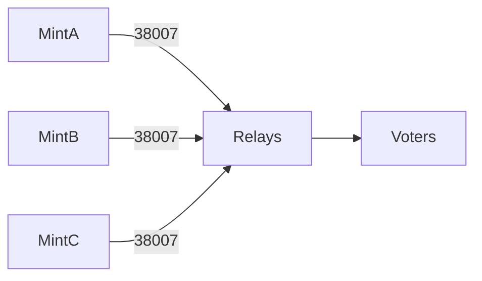
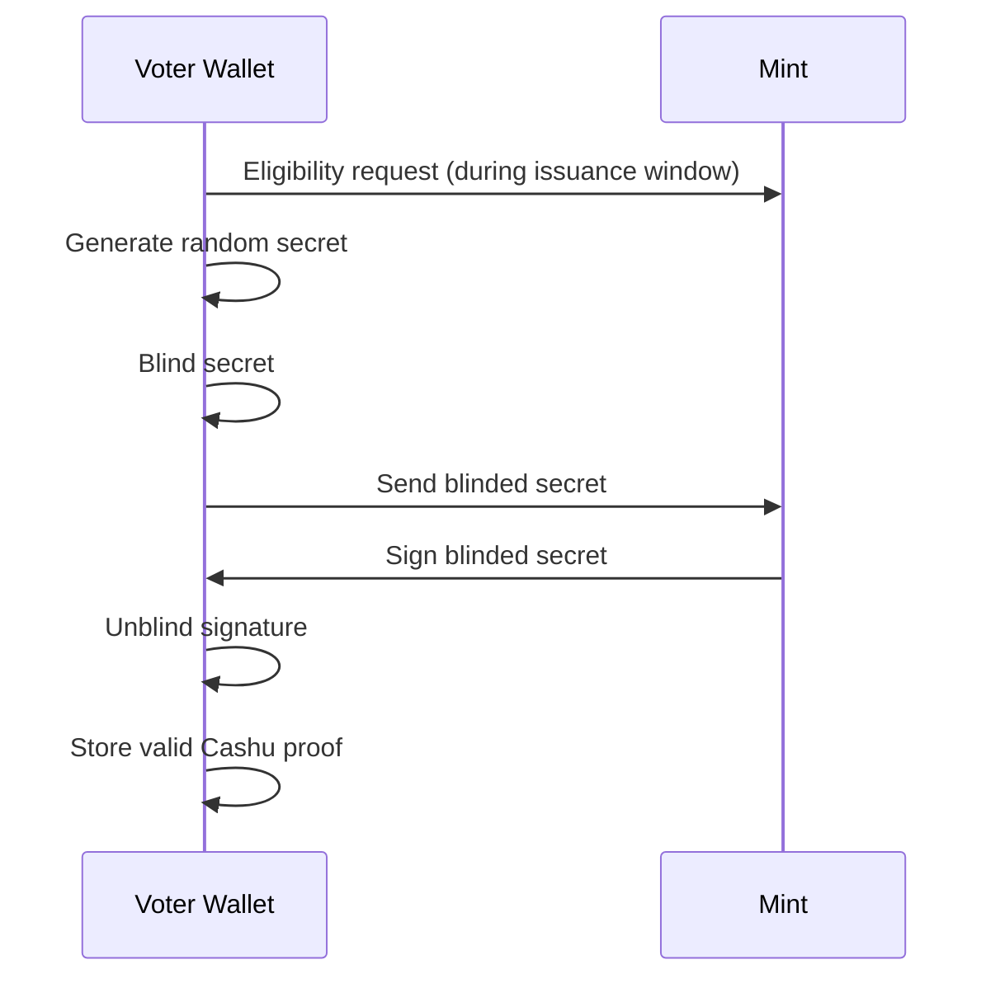
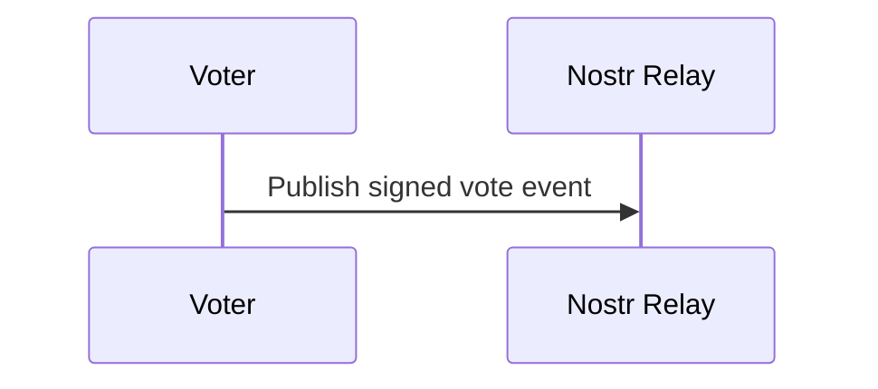
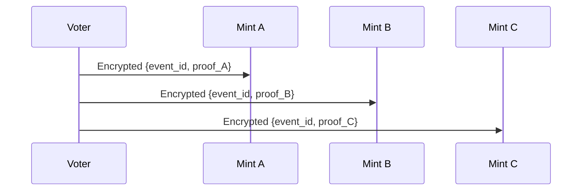
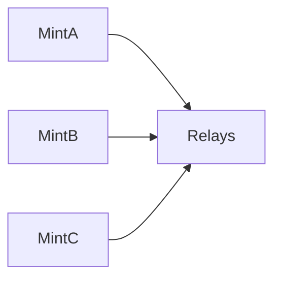

# Self-Service Issuance + 3-Mint Election Model

This document defines a privacy-preserving election architecture using:

- Self-service blind issuance window
- Three independent Cashu mints
- Threshold-style eligibility (k-of-3 recommended: 2-of-3)
- Nostr-based vote publication

The design provides:

- Unlinkable eligibility credentials
- Supply transparency
- Censorship resistance (bounded)
- Phantom voter resistance

---

# High-Level Model

Each voter must obtain blinded proofs from three independent mints during a public issuance window.

At vote time:

- Voter publishes a Nostr vote event.
- Voter submits proofs privately to each mint.
- Mints burn proofs and publish spent commitments.
- Final tally includes only votes backed by valid mint quorum.

Recommended validation rule:

    Vote valid ⇔ proofs from at least 2-of-3 mints are valid and unspent

---

# Actors

- Voter (runs Cashu wallet)
- Mint A
- Mint B
- Mint C
- Nostr relays
- Public verifiers

---

# Phase 1 — Election Creation

Each mint publishes:

- Election metadata
- max_supply
- Issuance window
- Voting window

All mints must reference the same election_id.



Invariant:

- max_supply is immutable per mint
- Election parameters are publicly visible before issuance begins

---

# Phase 2 — Self-Service Blind Issuance Window

Voters interact directly with each mint using a Cashu wallet.

Important property:

- Wallet generates secrets locally
- Wallet blinds secrets
- Mint signs blinded values
- Mint never sees unblinded secrets during issuance

## Sequence: Blind Issuance (Per Mint)



This process is repeated independently for Mint A, Mint B, and Mint C.

Privacy property:

- Mint cannot link final proof secret to issuance request.

---

# Phase 3 — Vote Publication

Voter publishes vote event publicly via Nostr.

Kind: 38000

```json
{
  "election_id": "...",
  "vote_choice": "Alice",
  "timestamp": 1710000000
}
```



Vote event does NOT contain any Cashu proofs.

---

# Phase 4 — Proof Submission (Out-of-Band)

Voter submits proofs privately to each mint.

Transport options:

- Encrypted Nostr DM (NIP-04 / NIP-44)
- HTTPS endpoint
- Tor strongly recommended



Each mint:

- Verifies proof signature
- Ensures proof not previously spent
- Burns proof
- Records commitment = SHA256(proof_secret)

---

# Phase 5 — Transparency Publication

Each mint publishes:

- issuance_commitment_root
- spent_commitment_root
- total_issued
- total_spent



Public verifiers check:

- spent ⊆ issuance
- total_issued <= max_supply
- total_spent <= total_issued

---

# Vote Validation Rule (2-of-3 Recommended)

A vote is valid if:

1. Vote event is included in vote Merkle tree
2. At least 2 mints include the corresponding proof commitment in their spent tree

This prevents:

- Single-mint censorship
- Single-mint phantom voter injection

---

# Adversarial Analysis

## Threat 1 — Single Malicious Mint

If 1 mint:

- Refuses issuance → voter can still obtain 2-of-3
- Refuses burn → 2-of-3 still sufficient
- Attempts phantom issuance → cannot fabricate quorum alone

Security holds if ≥ 2 mints are honest.

---

## Threat 2 — Two Colluding Mints

If 2 mints collude:

- They can censor (block quorum)
- They can fabricate eligibility

This is the quorum failure boundary.

Trust assumption:

    At least 2 mints behave honestly.

---

## Threat 3 — Issuance Bias

Each mint controls its issuance policy.

Mitigation:

- Transparent eligibility rules
- Public issuance window
- Independent auditors

Bias requires ≥ 2 mints to align to affect quorum.

---

## Threat 4 — Mint Learns Vote Identity

Blind issuance prevents linking proof to issuance identity.

Mint only learns:

- Proof secret at burn time
- Associated vote event id

Mint does NOT learn:

- Which human received that proof

Unless blind protocol is broken or network metadata is logged.

---

## Threat 5 — Network-Level Deanonymization

Possible if mints log:

- IP addresses
- Timing correlations

Mitigation:

- Wallet uses Tor
- Delay between issuance and voting
- Multiple relays

---

# Trust Model Summary

Compared to a single-mint design:

- Phantom voter attack requires ≥ 2 mints colluding
- Censorship requires ≥ 2 mints colluding
- Eligibility inflation requires ≥ 2 mints colluding

This is a Byzantine-style threshold trust model without a blockchain.

Security assumption:

    Fewer than 2 mints are malicious.

---

# Privacy Guarantees

- Votes are public but unlinkable to identity
- Proof issuance is blind
- Proof submission is private
- No proof appears in public vote events

The system achieves anonymous eligibility with auditable bounded supply.

---

# Recommended Parameters

- Number of mints: 3
- Quorum requirement: 2-of-3
- Blind issuance mandatory
- Issuance + spent commitment roots required
- Tor recommended for wallet transport

---

This model provides strong censorship resistance, bounded trust, and preserved voter anonymity without introducing blockchain consensus.
